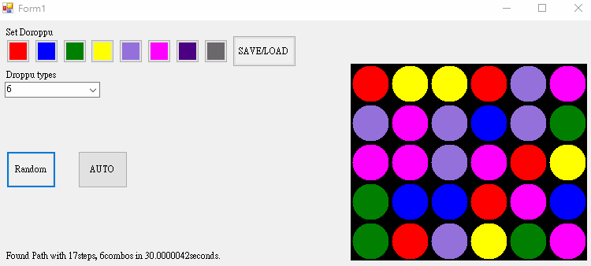

# pademu

 Eimulate game ”puzzle and dragon” on C# WindowsApp.

# Game Screen

# Controls(top left to bottom right)
* Color Buttons: \
set droppus on panel  

* Save/Load: \
save and load board

* Droppu Type: \
number of types of falling droppu

* Random: \
randomize board

* Auto: \
search and auto play 7 combos path

* Panel: \
display board state and play game

